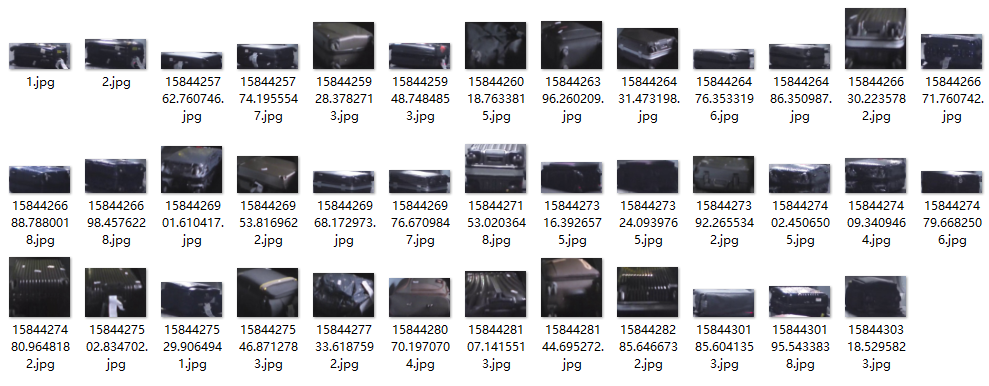
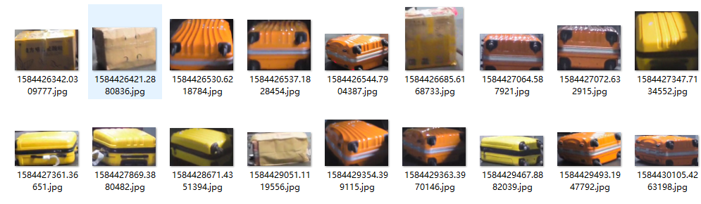
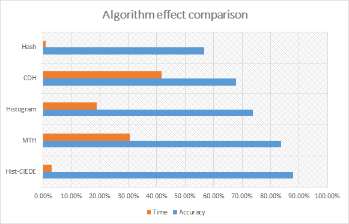

# Color similarity calculation —— Hist-CIEDE

这是一种根据颜色计算相似度的方法，我们称之为Hist—CIEDE。这种方法基于全局的考虑将图片颜色进行编码，通过比较编码的相似性确定整个图像物体颜色相近度，使得单点颜色比较转换为图像物体的比较。

## 背景

本方法用于航空运输中的行李唯一性匹配，辅助RFID标签辨别行李的信息，通过此方法比较行李的颜色可以排除大量的干扰项。在考虑行李本身图像时，我们使用与人眼相近的LAB颜色空间，借助颜色直方图的思想，提出了基于颜色特征的物体匹配Hist-CIEDE方法。

## 算法介绍

### 算法步骤

考虑我们的研究对象行李图像，同一行李角度可能是不同的，颜色的分布与细节必定会存在差异，这种情况下的我们需要的是行李大体上与其他行李的颜色区别，而需要忽略一些细节，只保留结构、明暗等基本信息，摒弃不同尺寸、比例带来的图片差异。

基于这个认识，算法流程的如下：   

1. 缩小图片尺寸将图片resize至（32,32）后，进行图像切割获取10%-90%中心区域的新图像   
2. 降低位深，计算像素值对于图像的RGB三个通道，遍历图片像素，将通道值（0-255）缩小64倍，映射到4个区间（0-3）并统计每个区间的次数   
3. 统计区间次数分别对RGB通道的4个区间按照次数排序   
4. 加权RGB值将出现次数前三的区间值与次数进行加权，得到区间映射后的加权RGB值   
5. 返回综合RGB结果将RGB分别扩大64倍得到行李A，B的平均RGB值   
6. 计算色差将行李A，B加权后的RGB值输入CIEDE公式进行距离  

### 特别说明

- 将图片进行放缩的原因是为了忽略图像细节，同时加速计算。而且实验中我们发现，截取的图像具有背景边缘等干扰。由于颜色计算是基于图片全部像素，因此综合考虑，为了准确获取行李的颜色，在不影响行李主体的基础上截取掉一部分的背景。   
- 在颜色直方图方法的计算中，为了降低计算的复杂度，对于图像的像素进行了RGB通道值区间的放缩，然后进行余弦距离的计算。借鉴这种分段的方式，我们对图像的RGB通道值进行放缩，这也是一种忽略细节的方式。图像像素的计算不是精度的唯一的，是模糊映射的同时又带有区分度。这种方法既考量了某一RGB颜色元素过多导致均值偏离的干扰,又考量了区分颜色的需要。基于RGB的范围变化规律，选取了段长64作为一个区分区间。   
- 对于其中的CIEDE公式：    CIEDE公式建立于LAB颜色空间，LAB颜色空间是基于人眼对颜色的感知，可以表示人眼所能感受到的所有颜色。L表示明度，A表示红绿色差，B表示蓝黄色差。技术委员会TC1-47（Hue and Lightness Dependent Correction to Industrial Colour Difference Evaluation）对现有色差公式和视觉评价数据的分析与测试，在2000年提出了一个新的色彩评价公式，并于2001年得到了国际照明委员会的推荐，称为CIE2000色差公式。CIEDE2000是到目前为止最新的色差公式，很好的考虑了光度亮度补偿度，计算色差更接近于人眼观测,色差越小代表越接近。

## 效果测试

### 实验设计

#### 数据集选择

实验设计的原则与条件数据集的选择与介绍在行李数据集上进行了基于颜色的数据集划分：将与人的肉眼判断相近的颜色放置于一个颜色区域，形成了黑色、白色、黄色等颜色的7种颜色文件库【如下图】，每个文件中拥有约100张颜色近似的图片，不同文件夹中行李的颜色差别较大。                             

#### 评价标准

计算属于同颜色区域图像的匹配度与不同颜色区域图像匹配度的大小关系。若是同颜色区域图像相较于不同颜色区域图像的匹配度更高，则认为算法对于这一组数据有区分度，最后计算准确率与时间效率。

#### 参数的设置    

分为两个子实验：

1. 使用原图进行对比
2. 对于所有的行李图像进行缩放，统一尺寸至32\*32，作为提高时间效率后的对照组。    

为了保证结果的稳定性，基于颜色数据集随机生成1000组测试数据测试多次计算取平均值。

### 同类算法介绍

实验结果的描述实验算法介绍 Hist-CIEDE算法基于颜色直方图的思想，在LAB颜色空间中进行颜色差异的计算。因此我们选择了**直方图**与**感知哈希**两种相似算法。同时在LAB空间中选择了色差直方图（CDH)算法，以及广义的颜色特征描述算法（MTH）。

#### MTH

多文本直方图（MTH）**[引用]**是一种广义的视觉属性描述符，但没有任何图像分割或模型训练，并且基于Julesz的texton理论。它既可以用作形状，也可以用作颜色描述符。该算法基于四种特殊的texton类型分析相邻颜色和边缘方向之间的空间相关性，然后创建texton共现矩阵以使用直方图描述属性。

#### CDH

色差直方图（CDH）这种方法与现有的直方图完全不同；大多数现有的直方图技术只计算像素的数量或频率。然而，CDHs的独特之处在于，它计算了在L*a*b颜色空间中，不同背景下两个点在颜色和边缘方向上的知觉均匀色差。该方法更注重颜色、边缘方向和感知均匀色差，通过与人类视觉系统相似的特征表示对颜色、方向和感知均匀色差进行编码。该方法可以看作是一种结合边缘方向、颜色和感知均匀色差的新的视觉属性描述方法，并且不需要任何图像分割、学习过程或聚类实现就可以考虑空间布局。

### 实验结果     

- 实验1

|           | 直方图 | 感知哈希 | 算法      | CDH    | MTH    |
| --------- | ------ | -------- | --------- | ------ | ------ |
| Accuracy  | 73.2%  | 58.5%    | **89.2%** | 68.5%  | 84.7%  |
| Time Cost | 12.899 | 0.179    | 0.986     | 21.797 | 16.044 |

- 实验2

|           | 直方图 | 感知哈希 | 算法      | CDH   | MTH   |
| --------- | ------ | -------- | --------- | ----- | ----- |
| Accuracy  | 73.7%  | 56.7%    | **87.9%** | 67.8% | 83.7% |
| Time Cost | 0.190  | 0.009    | 0.031     | 0.417 | 0.306 |

- 统计直方图

​      

### 结果分析

1. 两组实验准确率接近

   实验中使用直方图计算图片颜色相似度，无论是原图还是缩放图，实验的准确度并没有明显的下降，但是与此同时时间效率可以提升10-100倍。这也是根据颜色特征寻找相似图片的原理：寻求大体上颜色分布相同的图片，忽略细节上的差异。

2. Hist算法表现良好

   在对比实验中，Hist表现出了良好的性能，相较于直方图方法提高5%-20%，同时时间效率提高10倍以上。相较于Hash算法更是有显著的提升。由于行李数据集图像视角变化大，人眼的判断分类也具有主观性，算法分别出现了不同的问题：

   （1）Hash算法对于全局像素进行指纹的收集然后计算指纹符合度，而输入的行李本身在不同摄像头下会发生较大的变化，整个图像结构变化大，导致指纹差别很大。

   （2）颜色直方图不能很好的区分基于人眼判断的色差，这导致了人眼区分的数据集不能很好的被颜色直方图区分。

   （3）基于LAB空间的CDH算法对于色差有很好的判断，也考虑了纹理以及形状的因素。但是行李的形状在不同视角下是不一样的，算法考虑形状、纹理反而会导致了判断结果的不稳定。

   （4）MTH算法很好的使用了texton来考虑广义的颜色分布结构，但是由于算法建立在RGB空间，算法得出的色差程度与人眼判断的色差有一些出入。

   ​		上述分析我们可以得出，算法需要对基于人眼判断的色差有较强的敏感性，同时对于颜色的判断不能依赖于物体的形状与纹理等局部结构，需要从整个物体的颜色及周围环境的颜色做一个全局的考虑。

   ​		Hist-CIEDE算法首先选择了LAB空间，使得色差标准接近与人的感知。为了避免行李形状变化带来的影响，从全局对色差进行定义。对直方图进行加权得到像素点，记录下图像的颜色信息，行李本身结构变化的影响度降低，而环境与行李的搭配、颜色类别成为了关注的重点。算法对于行李形状结构变化敏感度降低，而对于整体结构与颜色类别的敏感度上升。通过CIEDE公式连接了LAB空间与像素的颜色信息，由此在数据集上具有很好的效果，这也与我们的实验结果相同，基于全局结构的MTH算法同样具有较好的效果。

   ​		而且相较于其他直方图算法，Hist有更好的时间效率。直方图算法中需要进行余弦距离或直方图距离的计算，计算的复杂度与直方图的大小密切相关，CDH与MTH算法还需要对每个像素进行复杂多层次的空间转换得到新的直方图，这加大了计算的复杂度。Hist-CIEDE算法中巧妙的将直方图的距离比较转换为单点像素的色差比较，从而提高了运算速度。

3. Hist算法的缺陷

   （1）没有考虑颜色的空间分布。不能区分同种颜色位于不同位置的差别，这将导致Hist-CIEDE算法会混淆某些行李颜色一致但分布不同的图片。

   （2）加权会丢失信息。Hist-CIEDE的加权方式避免了直方图计算距离的复杂，但是同时丢失了颜色直方图的信息。这将导致不同的直方图可以得到相同的加权结果，而且算法对于物体形状改变的敏感度也降低。这将混淆形状不同颜色分布类似或者特定颜色分布的图片。

## 文件说明

├─README.assets 
├─README.md 
├─src.py ------------- // Hist-CIEDE源码
└─test --------------- // 测试
  ├─CDH.py 
  ├─Hash.py 
  ├─Histogram.py 
  ├─Hist_CIEDE.py 
  ├─img -------------- // 不同颜色的测试图片
  │ ├─black 
  │ ├─blue 
  │ ├─green 
  │ ├─purple 
  │ ├─red 
  │ ├─white 
  │ └─yellow 
  ├─mainTest.py 
  └─MTH.py 